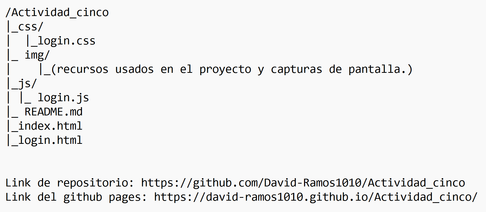

1. Portada, nombre del proyecto, integrantes del equipo y descripción breve.
2. Explicación y documentación: qué framework CSS usaron, cómo fluye el login hacia el sistema, cómo se pasa el nombre de usuario del login al navbar, cuáles son los métodos principales.
3.Proceso de creación, paso a paso de cómo armaron el login, el sidebar, el navbar con el usuario, el número de control y el modal, con capturas.
4. Capturas de pantalla del flujo completo funcionando.

# Actividad cinco - Creación de un login funcional con acceso a un sistema simulado.
## Se va a crear un login con funcionalidades de la utilería creada con anterioridad.
Todo lo anterior se va a documentar en GitHub (en un README) y se publicara en Pages siguiendo la siguiente estructura:
***
#### Elaborado por: David Efraín José Ramos NL 19  y Alvarez Mora Jordi Moises.

## Descripción breve:

***
### Explicación y documentación:
#### Creación del login (con capturas):
#### Creación del sidebar (con capturas):
#### Creación del navar con el usuario, el número de control y el modal (con capturas):
 
### Capturas de pantalla del flujo completo funcionando:

#### Elaborado por: David Efraín José Ramos NL 19