1. Portada, nombre del proyecto, integrantes del equipo y descripción breve.

2. Explicación y documentación: qué framework CSS usaron, cómo fluye el login hacia el sistema, cómo se pasa el nombre de usuario del login al navbar, cuáles son los métodos principales.

3.Proceso de creación, paso a paso de cómo armaron el login, el sidebar, el navbar con el usuario, el número de control y el modal, con capturas.

4. Capturas de pantalla del flujo completo funcionando.

# Actividad cinco - Creación de un login funcional con acceso a un sistema simulado.
## Se va a crear un login con funcionalidades de la utilería creada con anterioridad.
Todo lo anterior se va a documentar en GitHub (en un README) y se publicara en Pages siguiendo la siguiente estructura:
***
#### Elaborado por: David Efraín José Ramos NL 19  y Álvarez Mora Jordi Moisés.

## Descripción breve:

***
### Explicación y documentación:
#### Creación del login (con capturas):
Para empezar, el login se creó a partir de una sección principal y se dividió en dos secciones. Un panel derecho y un panel izquierdo con sus respectivas clases en la hoja de estilos, llamadas:
Principal: auth-layout
Panel izquierdo: brand-panel
Panel derecho: form-panel

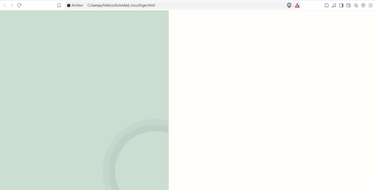

Esta declarado de la siguiente manera desde el HTML:

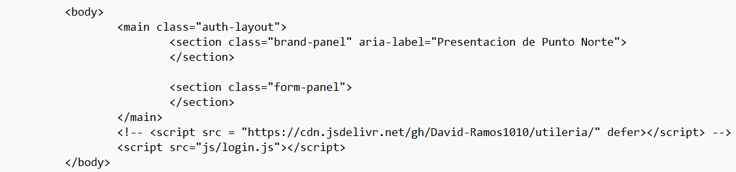

Sus formatos en la hoja de estilos son:

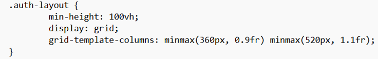
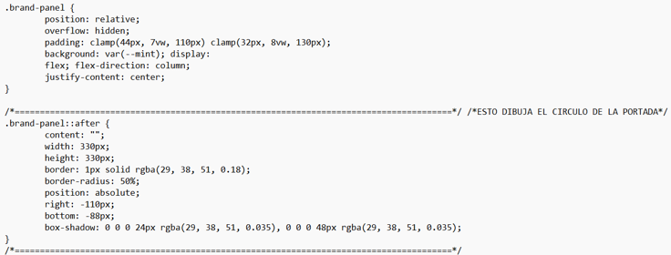
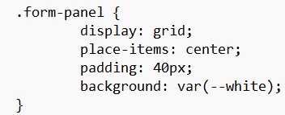

Con esta parte del código podemos poner un espacio publicitario estático en el panel izquierdo:

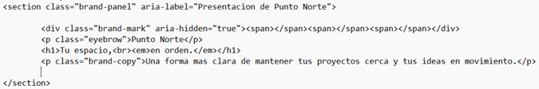

En nuestro caso pusimos:

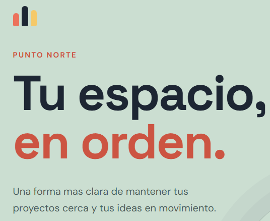

Con este otro div pusimos una pequeña señal:

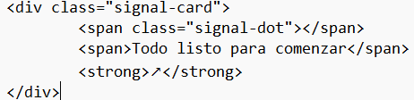

Así se ve en el panel izquierdo:

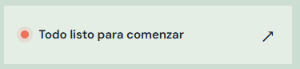

Todo en conjunto en el panel izquierdo se ve así:

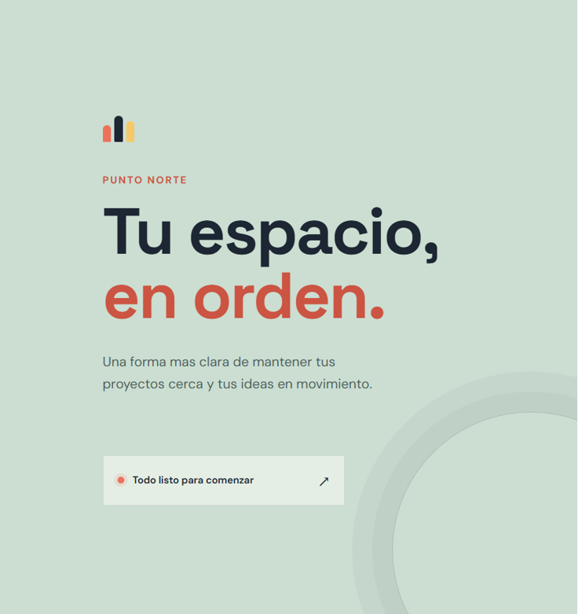

Ahora vamos con el panel derecho:

Este tiene un pequeño logo el cual al inicio no funcionaba porque estaba muy desfazado. 

Este esta declarado en el HTML de esta manera y tiene formato en la hoja de estilos.

Ahora continuamos con las etiquetas principales del panel izquierdo, las cuales están declaradas de la siguiente manera en el HTML:

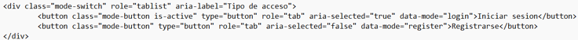

Se ve de la siguiente manera:

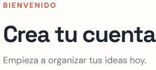

La siguiente parte es crucial ya que envía una verificación para saber qué información será mostrada en la pantalla:

Como se puede mostrar son dos botones los cuales tienen estilos y muestra diferente información.
Se ven de la siguiente manera:

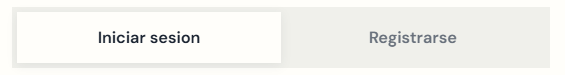

La siguiente parte es el formulario que cuenta con tres conjuntos como de cuadros de texto para enviar la información a un js y ejecutar funciones:

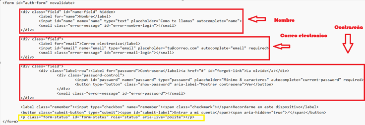

Es importante mencionar que en el apartado de contraseña declare un hipervínculo que simula la situación de cuando alguien olvida su contraseña.

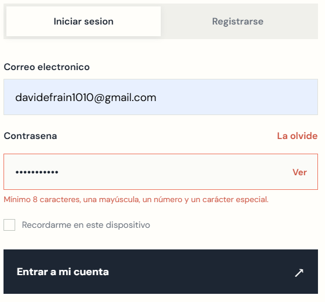

Abajo solo le añadí un texto con dos hipervínculos.

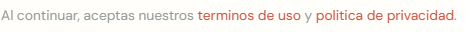

La otra parte crucial de lo que yo hice fueron las validaciones en JavaScript. Me encargue de validar que el correo electrónico fuera correcto, que la contraseña tuviera máximo ocho caracteres con al menos un carácter especial y que en el nombre no pudiera meter números. Igual desde el JavaScript hice el cambio dinámico entre registrarse e iniciar sesión.

Las validaciones que yo añadí de mi utilería fueron las siguientes:

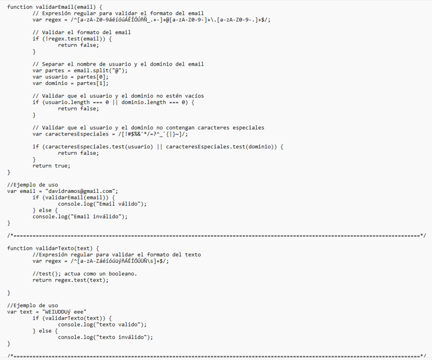
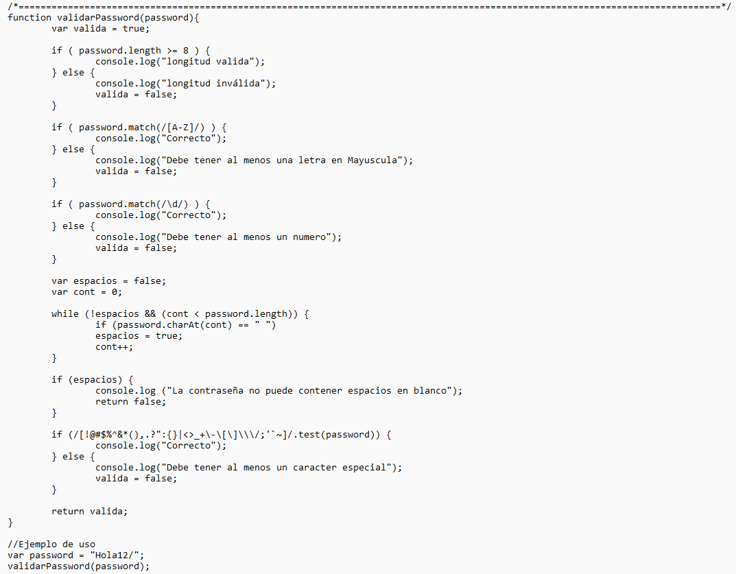

Así se ven los ejemplos desde consola:

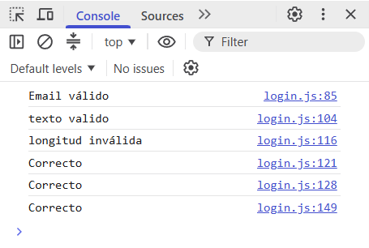

La siguiente parte del código es la que se encarga de validar los datos dados desde el HTML y devuelven un span.

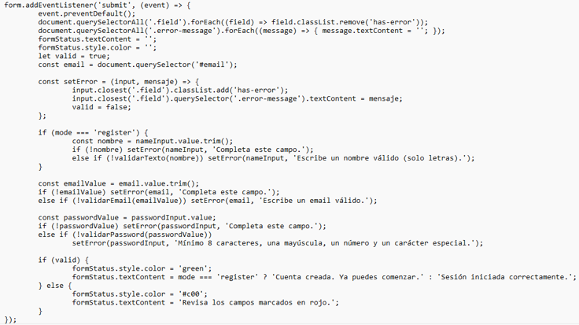

Se ve de la siguiente manera:

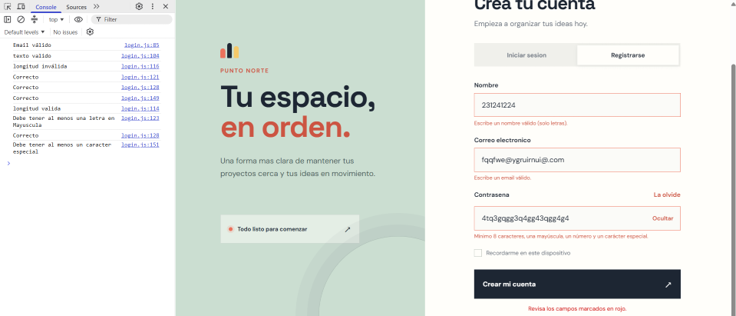

Por último, cree un nabar en el index. Apenas lo modificare:

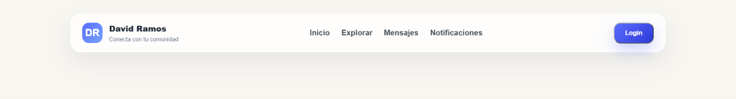

Esta parte fue declarada de la siguiente manera y fue modificada desde la hoja de estilos:

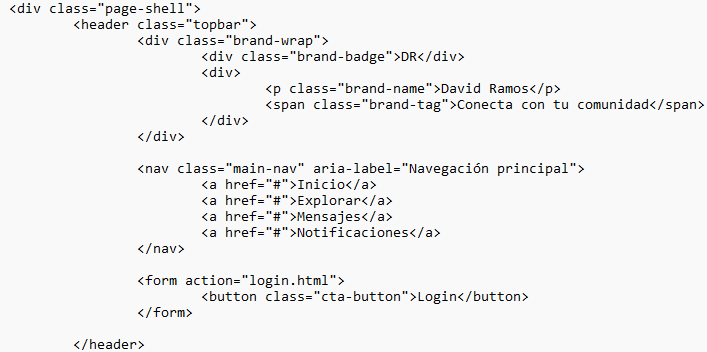

#### Creación del sidebar (con capturas):
Código HTML y CSS del Sidebar:
   
   Se definió una estructura con la clase .has-submenu para albergar el menú de Usuarios y la opción Captura. En el archivo login.css se agregaron los estilos para controlar su posición y animación.
   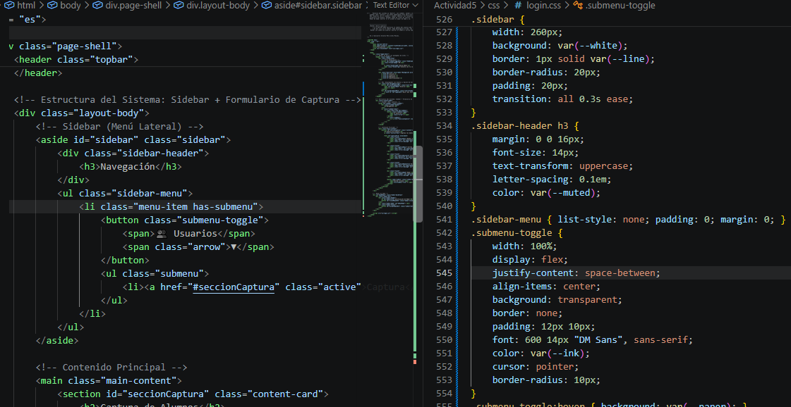

Lógica de control en JavaScript:
   
   Se vinculó el botón hamburguesa (#sidebarToggleBtn) con un controlador de eventos que alterna la clase .is-closed sobre el elemento #sidebar.
   

Resultado en la interfaz:
   
   Al hacer clic en el botón hamburguesa se despliega el menú lateral con la opción para navegar a la sección de Captura.
   
   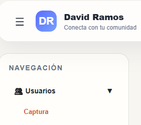

#### Creación del navar con el usuario, el número de control y el modal (con capturas):
Navbar con Usuario y Cierre de Sesión:
   
   Código JS: Al cargar la página se lee sessionStorage y se escribe el nombre en #navUserName. Al presionar el botón de cerrar sesión, se ejecuta sessionStorage.removeItem('usuarioLogueado') y se redirige a login.html.

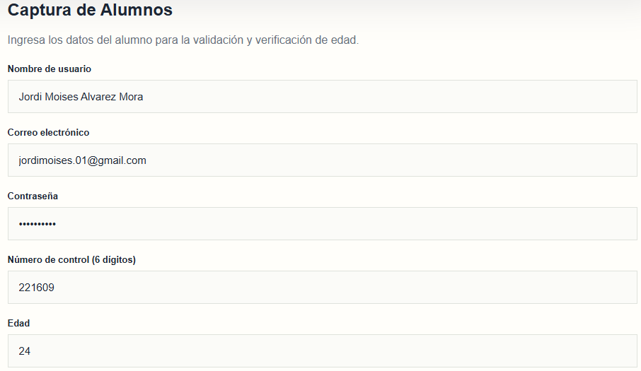

Interfaz visual: 
    
Despliegue del menú flotante al hacer clic en el nombre de usuario.

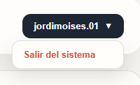

Formulario de Alumnos y Validación de Número de Control:

   Código HTML y JS: Se estableció el campo de número de control con maxlength="6". En JavaScript se evalúa mediante la expresión regular /^\d{6}$/.

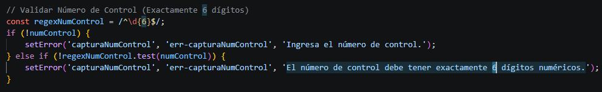
    
   Interfaz visual: Captura de pantalla mostrando la validación de los 6 dígitos numéricos.

### Capturas de pantalla del flujo completo funcionando:
1.- Pantalla de Login con validaciones de correo y contraseña:
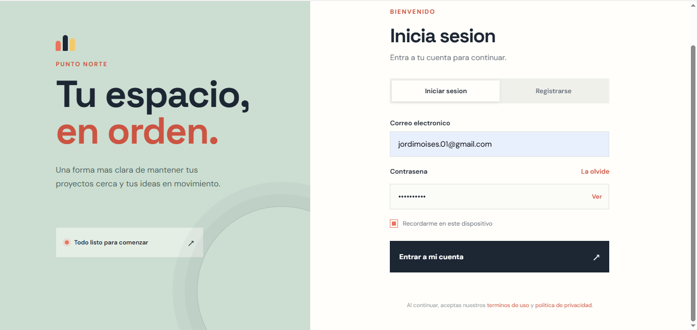

2.- Redirección e ingreso exitoso a index.html reflejando el usuario en el Navbar:
   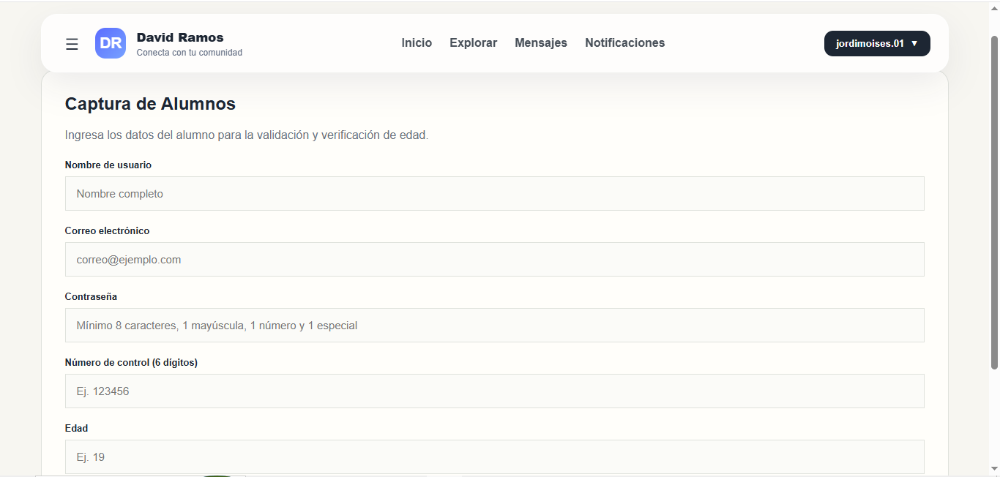

3.- Apertura del Sidebar mediante el botón hamburguesa y navegación a Captura:
   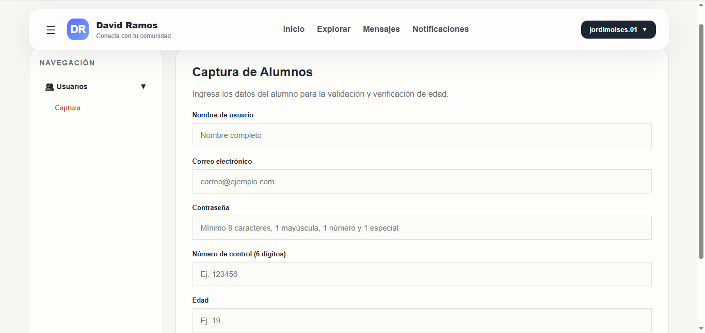

4.- Validación del formulario de alumnos (comprobando los datos introducidos en el formulario):
   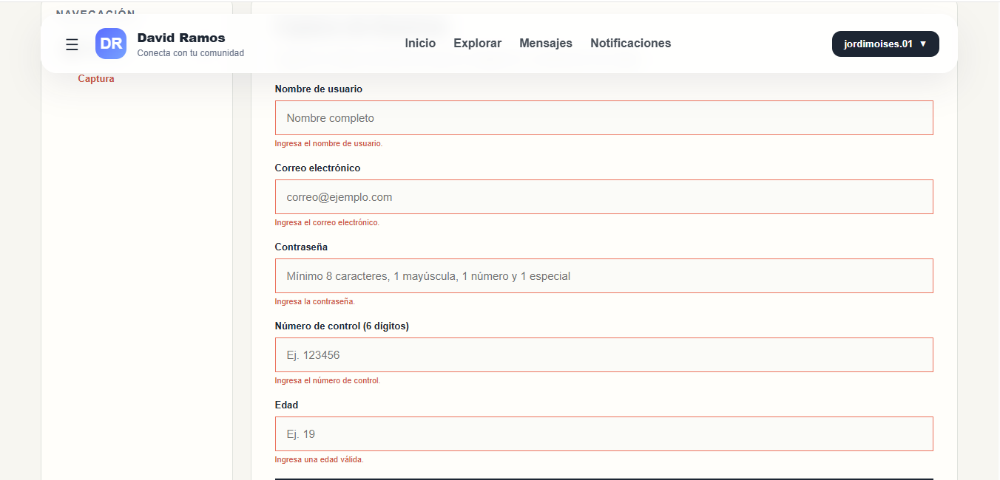

5.- Despliegue del Modal interactivo con el resultado de verificación de edad:
   

6.- Cierre de sesión desde el menú del usuario y regreso automático a login.html:
   

#### Elaborado por: David Efraín José Ramos NL 19
#### Elaborado por: Jordi Moisés Alvaréz Mora NL 2
